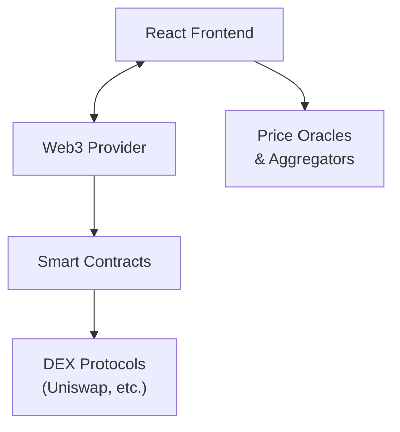
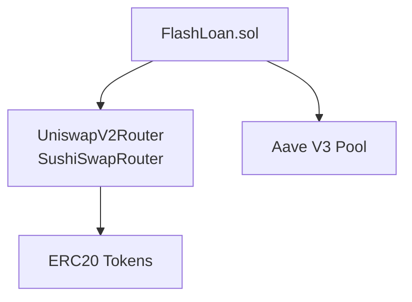
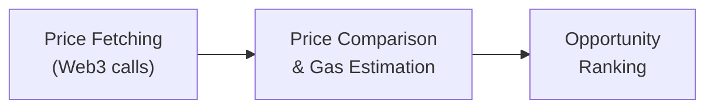
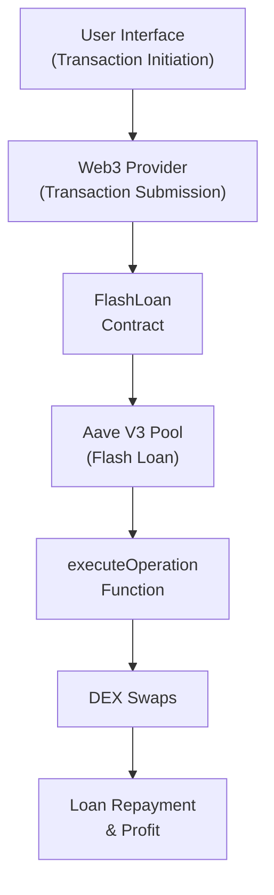

# Flash System Architecture

This document provides a detailed overview of the Flash system's architecture, including component interactions, data flows, and technical implementation details.

## System Overview

Flash is a DeFi arbitrage platform that leverages flash loans to execute profitable trades across decentralized exchanges without requiring upfront capital. The system is designed with a clean separation of concerns, following a modular architecture that enhances maintainability and extensibility.

## Component Architecture

### High-Level Architecture

### 1. Smart Contract Layer

The smart contract layer is the core of the Flash system, handling all on-chain operations.

#### Key Components

- **FlashLoan.sol**: The central contract that implements the Aave flash loan receiver interface and orchestrates the arbitrage execution.
  - Manages flash loan borrowing and repayment
  - Executes DEX swaps through approved routers
  - Implements safety mechanisms and access controls
  - Handles profit calculation and verification

- **UniswapInteractor.sol & SushiSwapInteractor.sol**: Exchange-specific contracts that standardize interactions with different DEXs.
  - Implement swap functions with error handling
  - Provide price discovery methods
  - Manage token approvals and transfers

- **Interfaces**: Standardized interfaces for interacting with external protocols:
  - Aave V3 interfaces for flash loan functionality
  - DEX router interfaces for trading operations
  - Token interfaces for ERC20 interactions

#### Dependency Graph

### 2. Migration System

The migration system handles the deployment and initialization of smart contracts across different environments.

#### Key Components

- **Migration Scripts**: Progressive deployment scripts that:
  - Deploy the core FlashLoan contract
  - Configure DEX router approvals
  - Set up necessary permissions and parameters
  - Validate the deployment state

- **Network Configuration**: Environment-specific settings that adapt the deployment to different networks:
  - Development (local Ganache)
  - Development fork (Mainnet or Sepolia fork)
  - Testnet (Sepolia)
  - Production (Ethereum Mainnet)

### 3. Frontend Application

The frontend provides a user interface for monitoring arbitrage opportunities and executing trades.

#### Key Components

- **Web3 Provider Layer**: Manages blockchain connectivity and state:
  - `Web3Provider.tsx`: Context provider for wallet connection
  - `WalletConnection.tsx`: UI component for wallet interaction
  - `web3.ts`: Utility functions for blockchain interaction

- **Core Components**:
  - `ArbitrageOpportunities.tsx`: Monitors and displays price differentials
  - `FlashLoanOptions.tsx`: Interface for configuring and executing flash loans
  - `TransactionFees.tsx`: Displays network fees and cost estimates

- **State Management**: Uses React Context API to manage:
  - Wallet connection state
  - Network information
  - Price data
  - Transaction history

## Data Flow

### Arbitrage Opportunity Discovery

1. The frontend polls DEX contracts to fetch current token prices
2. Price comparison logic calculates potential profit accounting for:
   - Flash loan fees (0.09% for Aave V3)
   - Gas costs for the transaction
   - Slippage tolerance
   - Exchange fees
3. Viable opportunities are ranked by profitability and displayed to the user

### Flash Loan Execution

1. User initiates a flash loan transaction through the UI
2. The transaction is submitted through Web3Provider to the blockchain
3. The FlashLoan contract calls Aave to borrow the specified tokens
4. Aave transfers tokens and calls back to the contract's `executeOperation` function
5. Inside `executeOperation`:
   - The borrowed tokens are swapped on the first DEX for WETH
   - The WETH is swapped on the second DEX back to the original token
   - The contract verifies that the final amount exceeds the repayment amount
   - The loan is repaid to Aave
   - Any remaining profit stays in the contract
6. Transaction results are emitted as events

## Technical Implementation Details

### Flash Loan Mechanism

The Flash Loan process relies on Aave V3's flash loan protocol, which allows borrowing assets without collateral as long as the loan is returned within the same transaction. The implementation follows these steps:

1. **Loan Request**: The `requestFlashLoan` function in the FlashLoan contract is called with:
   - Token address to borrow
   - Amount to borrow
   - Source router (cheaper DEX)
   - Target router (more expensive DEX)
   - Intermediate token (typically WETH)
   - Slippage tolerance

2. **Callback Execution**: When funds are received, Aave calls the `executeOperation` function with:
   - Asset address
   - Borrowed amount
   - Premium (fee)
   - Initiator address
   - Encoded parameters for the arbitrage

3. **Swap Logic**:
   - A path is constructed from the borrowed asset to the intermediate token
   - The first swap is executed on the source router
   - A second path is constructed from the intermediate token back to the original asset
   - The second swap is executed on the target router

4. **Profit Verification**:
   - The contract checks if the final token balance exceeds the repayment amount
   - If sufficient, the loan is approved for repayment
   - If insufficient, the transaction reverts

### Price Monitoring System

The frontend implements a price monitoring system that:

1. Maintains connection to multiple DEXs via their respective router contracts
2. Periodically fetches price data using the `getAmountsOut` function
3. Calculates price differences between exchanges
4. Determines if the difference exceeds gas costs and flash loan fees
5. Updates the UI with viable opportunities
6. Implements throttling and caching to prevent excessive API calls

### Gas Optimization Techniques

The Flash contracts implement several gas optimization techniques:

1. **Minimal Storage Usage**: Uses immutable variables and memory over storage where possible
2. **Efficient Approvals**: Precise approval amounts rather than unlimited approvals
3. **Direct Router Calls**: Calls router contracts directly rather than through abstractions
4. **Path Optimization**: Minimizes swap paths to reduce gas consumption
5. **Custom Error Types**: Uses custom errors rather than revert strings
6. **Contract Size Reduction**: Modular design to keep contracts below size limits

## Security Considerations

### Attack Vector Mitigations

1. **Front-running Protection**:
   - Slippage tolerance parameters
   - Deadline restrictions on swaps
   - Minimum output requirements

2. **Access Controls**:
   - Owner-restricted functions for router approval
   - Fee system to prevent abuse of flash loan capability

3. **Input Validation**:
   - Comprehensive parameter validation
   - Address verification
   - Amount checks

4. **Fail-Safe Mechanisms**:
   - Transaction reversion for unprofitable trades
   - Safe token approval patterns
   - Protection against reentrancy

## Future Architecture Extensions

1. **Multi-Hop Arbitrage**:
   - Support for arbitrage routes with multiple intermediate tokens
   - More complex path finding algorithms

2. **Additional DEX Support**:
   - Integration with Balancer V2
   - Integration with Curve Finance
   - Support for Uniswap V3 direct execution

3. **Cross-Chain Arbitrage**:
   - Layer 2 solution integration
   - Cross-chain bridges for arbitrage between networks

4. **Advanced Analytics**:
   - Historical arbitrage opportunity tracking
   - Profitability prediction models
   - Gas price optimization algorithms
