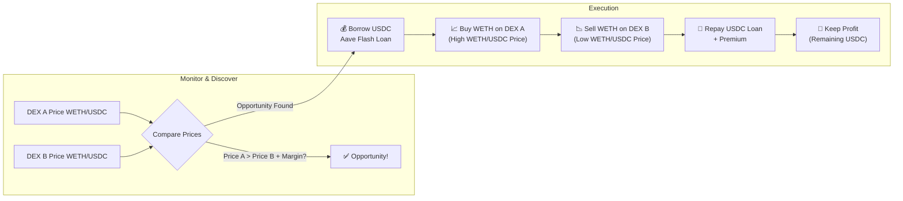
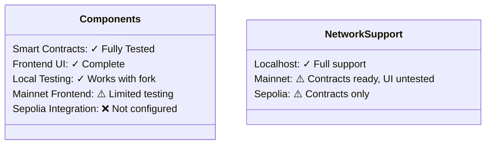

<div align="center">
  

# Flash

  <h3><em>Effortless DeFi Arbitrage</em></h3>

[](https://soliditylang.org/)
[](https://nextjs.org/)
[](LICENSE)

</div>

## ⚡ Discover Opportunities. Execute Seamlessly.

Flash transforms arbitrage trading with an elegant system that empowers you to identify and capitalize on price differences between decentralized exchanges—all without requiring capital upfront through the power of flash loans.

<div align="center">
  <a href="./contracts/README.md">📄 Smart Contracts</a> •
  <a href="./frontend/README.md">🖥️ User Interface</a> •
  <a href="./migrations/README.md">🚀 Deployment</a> •
  <a href="./test/README.md">🧪 Testing</a> •
  <a href="./ARCHITECTURE.md">🏗️ Architecture</a>
</div>

## 🔑 Key Features

<table>
  <tr>
    <td width="33%" align="center">
      <h3>🔍</h3>
      <strong>Automated Detection</strong><br />
      <small>Identifies profitable opportunities across exchanges in real-time</small>
    </td>
    <td width="33%" align="center">
      <h3>💸</h3>
      <strong>Zero Capital Trades</strong><br />
      <small>Executes trades with Aave flash loans—no upfront capital needed</small>
    </td>
    <td width="33%" align="center">
      <h3>📊</h3>
      <strong>Beautiful Interface</strong><br />
      <small>Intuitive dashboard for monitoring and executing with ease</small>
    </td>
  </tr>
</table>

## 🔄 How It Works

The core arbitrage strategy for USDC -> WETH -> USDC involves:

1.  **Monitoring:** Tracking WETH/USDC prices across DEXs.
2.  **Discovery:** Identifying when DEX A offers a *higher* WETH/USDC price than DEX B by a sufficient margin.
3.  **Execution:**
    *   Borrow USDC via Aave flash loan.
    *   Buy WETH on DEX A (where WETH/USDC price is highest).
    *   Sell WETH on DEX B (where WETH/USDC price is lowest).
    *   Repay USDC loan + premium.
    *   Keep the remaining USDC as profit.



## 🏁 Try Flash Today

The quickest way to experience Flash is with our streamlined local setup:

**1. Clone the Repository**

```bash
# Clone the repository and navigate into the directory
git clone https://github.com/natalie-a-1/Flash.git
cd Flash
```

**2. Configure Environment Variables**

Copy the example environment files. You will need to edit these to include your specific RPC URLs and wallet details.

```bash
# Create/Populate Root .env file (for Truffle, Ganache, backend scripts)
cp .env.example .env 
# -> EDIT .env and fill in MAINNET_RPC_URL, MNEMONIC, USDC_WHALE_ADDRESS

# Create/Populate Frontend .env.local file (for Next.js App)
cp .env.example frontend/.env.local
# -> EDIT frontend/.env.local and ensure NEXT_PUBLIC_MAINNET_RPC_URL is set
```

**3. Install Dependencies**

Install necessary packages for both the root project and the frontend.

```bash
# Install root dependencies
npm install

# Install frontend dependencies
cd frontend && npm install && cd ..
```

**4. Start the Development Environment (One Command!)**

Our simplified setup process handles everything in a single command:

```bash
# This single command:
# 1. Compiles contracts (if needed)
# 2. Starts Ganache fork with Chain ID 1337
# 3. Verifies if the FlashLoan contract exists
# 4. Deploys a new contract if needed
# 5. Automatically approves router contracts
npm run fork:with-approvals
```

This command will start a Ganache fork with all necessary setup for router approvals. Keep this terminal window running while developing.

**5. Launch the Frontend Application (New Terminal)**

In a new terminal window, start the Next.js development server:

```bash
cd frontend 
npm run dev
```

Visit `http://localhost:3000` and connect your wallet (configured for localhost:8545, Chain ID 1337) to start exploring arbitrage opportunities.

> **Note:**
> - The `fork:with-approvals` script handles contract compilation, Ganache startup, contract deployment, and router approvals all in one command.
> - You must restart the `fork:with-approvals` script each time you want a fresh Ganache instance.
> - For more details on the router approval process, see [docs/ROUTER_APPROVALS.md](docs/ROUTER_APPROVALS.md).

<!-- <div align="center">
  
</div> -->

## 🔄 Supported Exchanges


## 📊 Current Status

Flash has been extensively tested in a local development environment with a forked Ethereum mainnet. The smart contracts and frontend are fully functional in this environment, allowing you to execute complete arbitrage workflows.



For detailed status information, visit our component documentation:

- [Smart Contract Status](./contracts/README.md#development-status)
- [Frontend Status](./frontend/README.md#network-compatibility)
- [Deployment Guide](./migrations/README.md#network-support)

## 🌐 Join the Community

We welcome contributions and feedback from the community. Whether you're interested in extending support to new DEXs, improving the UI, or enhancing the contract logic, check out our component-specific documentation for development guidelines.

<div align="center">
  <h3>🤝</h3>
  <p><em>Building the future of DeFi together</em></p>
</div>

## 📜 License

Flash is available under the [MIT License](LICENSE).

## 🙏 Acknowledgments

Special thanks to the teams behind Aave, Uniswap, and SushiSwap for creating the infrastructure that makes Flash possible.

## Router Approvals for Flash Loans

When working with flash loans between Uniswap and SushiSwap, the Flash Loan contract must have approval to use these routers. Every time you restart a Ganache fork, these approvals are lost, which can cause errors.

We've implemented an automated solution that:

1. Detects if the Flash Loan contract exists
2. Deploys a new contract if needed
3. Automatically approves the routers

### Starting Your Development Environment

For the best development experience, use:

```bash
npm run fork:with-approvals
```

This command will:
- Start a Ganache fork of Ethereum mainnet
- Verify the FlashLoan contract exists
- Deploy a new contract if needed
- Approve Uniswap and SushiSwap routers

For full documentation, see [docs/ROUTER_APPROVALS.md](docs/ROUTER_APPROVALS.md).
