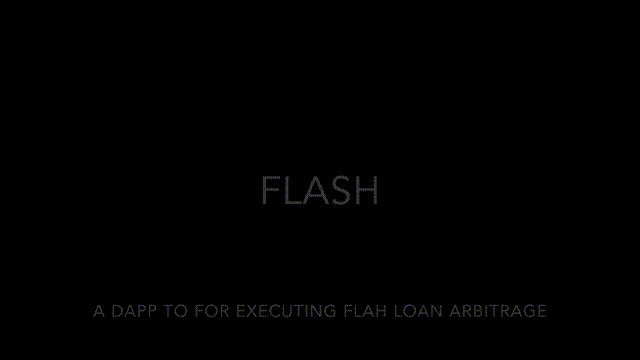

# Flash

*Effortless DeFi arbitrage with flash loans.*

This was my final semester project at university. It explores how flash loans and DEX price differences can be used to execute atomic arbitrage trades.

## Overview

Flash is a small system for spotting and executing arbitrage between decentralized exchanges using Aave flash loans.

It focuses on a USDC → WETH → USDC route and runs everything in a single transaction, so the trade either fully succeeds or fully reverts.

## Tech Stack

- **Smart contracts:** Solidity 0.8.20  
- **Frontend:** Next.js 15.3.0  
- **Lending:** Aave flash loans  
- **DEXs:** Uniswap-style AMMs (configurable)

## How It Works

1. Track WETH/USDC prices across multiple DEXs.  
2. Detect when a price gap is large enough to cover fees and profit.  
3. Take an Aave flash loan in USDC.  
4. Swap USDC → WETH on the cheaper DEX, then WETH → USDC on the more expensive DEX.  
5. Repay the flash loan plus fee and keep any remaining USDC as profit.  

All of this happens atomically in one transaction.

## Status

This is an educational project and has not been audited.  
