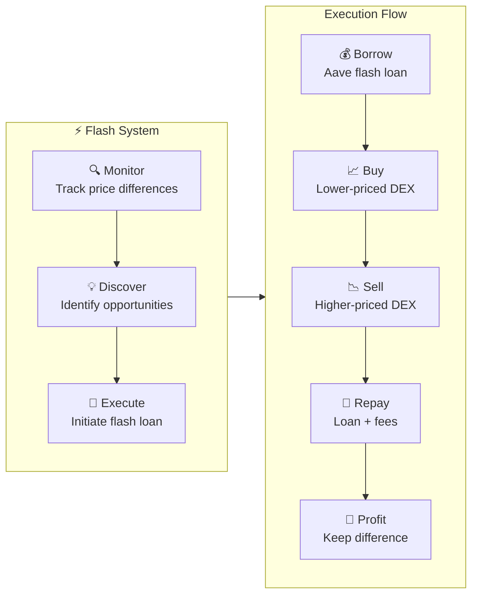
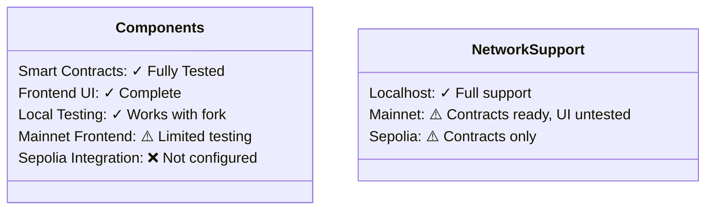

<div align="center">
  

# Flash

  <h3><em>Effortless DeFi Arbitrage</em></h3>

[](https://soliditylang.org/)
[](https://nextjs.org/)
[](LICENSE)
</div>

## ⚡ Discover Opportunities. Execute Seamlessly.

Flash transforms arbitrage trading with an elegant system that empowers you to identify and capitalize on price differences between decentralized exchanges—all without requiring capital upfront through the power of flash loans.

<div align="center">
  <a href="./contracts/README.md">📄 Smart Contracts</a> •
  <a href="./frontend/README.md">🖥️ User Interface</a> •
  <a href="./migrations/README.md">🚀 Deployment</a> •
  <a href="./test/README.md">🧪 Testing</a> •
  <a href="./ARCHITECTURE.md">🏗️ Architecture</a>
</div>

## 🔑 Key Features

<table>
  <tr>
    <td width="33%" align="center">
      <h3>🔍</h3>
      <strong>Automated Detection</strong><br />
      <small>Identifies profitable opportunities across exchanges in real-time</small>
    </td>
    <td width="33%" align="center">
      <h3>💸</h3>
      <strong>Zero Capital Trades</strong><br />
      <small>Executes trades with Aave flash loans—no upfront capital needed</small>
    </td>
    <td width="33%" align="center">
      <h3>📊</h3>
      <strong>Beautiful Interface</strong><br />
      <small>Intuitive dashboard for monitoring and executing with ease</small>
    </td>
  </tr>
</table>

## 🔄 How It Works



## 🏁 Try Flash Today

The quickest way to experience Flash is with our verified local setup:

```bash
# Clone the repository
git clone https://github.com/natalie-a-1/Flash.git
cd Flash

# Setup environment
cp .env.local .env
# Open .env and fill in NEXT_PUBLIC_ALCHEMY_API_KEY with your Alchemy API key

# Install dependencies
npm install
cd frontend && npm install && cd ..

# Start local Ethereum fork with deployed contracts
npm run ganache:mainnet:persistent

# In a new terminal, launch the frontend
cd frontend && npm run dev
```

Visit `http://localhost:3000` and connect your wallet to the localhost network to start exploring arbitrage opportunities.

<div align="center">
  
</div>

## 🔄 Supported Exchanges


## 📊 Current Status

Flash has been extensively tested in a local development environment with a forked Ethereum mainnet. The smart contracts and frontend are fully functional in this environment, allowing you to execute complete arbitrage workflows.



For detailed status information, visit our component documentation:
- [Smart Contract Status](./contracts/README.md#development-status)
- [Frontend Status](./frontend/README.md#network-compatibility)
- [Deployment Guide](./migrations/README.md#network-support)

## 🌐 Join the Community

We welcome contributions and feedback from the community. Whether you're interested in extending support to new DEXs, improving the UI, or enhancing the contract logic, check out our component-specific documentation for development guidelines.

<div align="center">
  <h3>🤝</h3>
  <p><em>Building the future of DeFi together</em></p>
</div>

## 📜 License

Flash is available under the [MIT License](LICENSE).

## 🙏 Acknowledgments

Special thanks to the teams behind Aave, Uniswap, and SushiSwap for creating the infrastructure that makes Flash possible.
