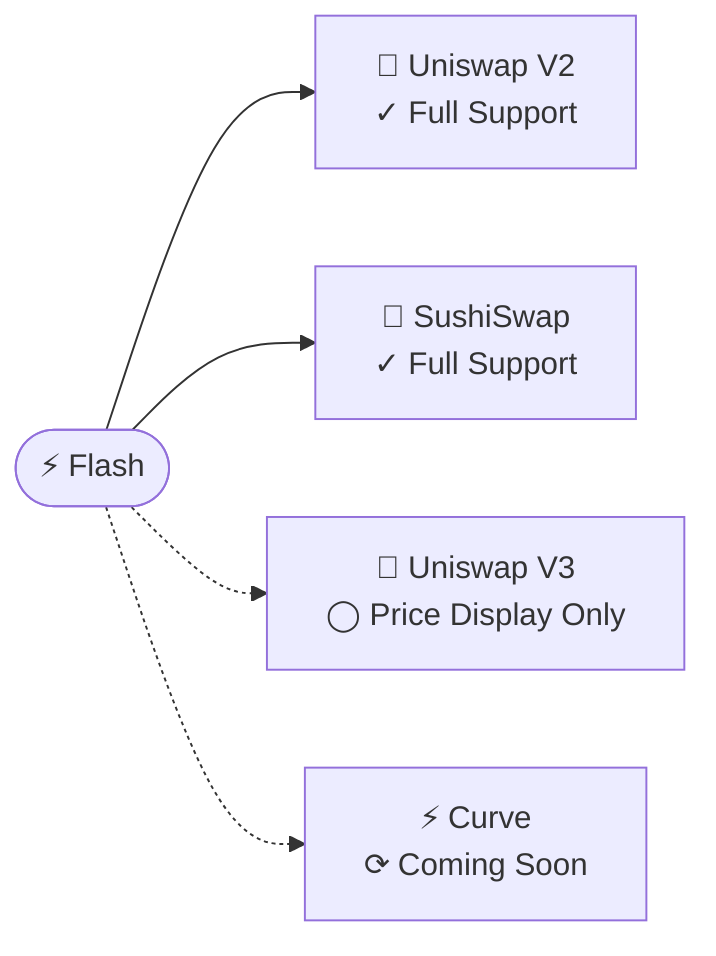
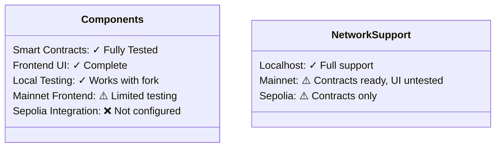

<div align="center">
  

# Flash

  <h3><em>Effortless DeFi Arbitrage</em></h3>

[](https://soliditylang.org/)
[](https://nextjs.org/)
[](LICENSE)

</div>

## ⚡ Discover Opportunities. Execute Seamlessly.

Flash transforms arbitrage trading with an elegant system that empowers you to identify and capitalize on price differences between decentralized exchanges—all without requiring capital upfront through the power of flash loans.

<div align="center">
  <a href="./contracts/README.md">📄 Smart Contracts</a> •
  <a href="./frontend/README.md">🖥️ User Interface</a> •
  <a href="./migrations/README.md">🚀 Deployment</a> •
  <a href="./test/README.md">🧪 Testing</a> •
  <a href="./ARCHITECTURE.md">🏗️ Architecture</a>
</div>

## 🔑 Key Features

<table>
  <tr>
    <td width="33%" align="center">
      <h3>🔍</h3>
      <strong>Automated Detection</strong><br />
      <small>Identifies profitable opportunities across exchanges in real-time</small>
    </td>
    <td width="33%" align="center">
      <h3>💸</h3>
      <strong>Zero Capital Trades</strong><br />
      <small>Executes trades with Aave flash loans—no upfront capital needed</small>
    </td>
    <td width="33%" align="center">
      <h3>📊</h3>
      <strong>Beautiful Interface</strong><br />
      <small>Intuitive dashboard for monitoring and executing with ease</small>
    </td>
  </tr>
</table>

## 🔄 How It Works

The core arbitrage strategy for USDC -> WETH -> USDC involves:

1.  **Monitoring:** Tracking WETH/USDC prices across DEXs.
2.  **Discovery:** Identifying when DEX A offers a *higher* WETH/USDC price than DEX B by a sufficient margin.
3.  **Execution:**
    *   Borrow USDC via Aave flash loan.
    *   Buy WETH on DEX A (where WETH/USDC price is highest).
    *   Sell WETH on DEX B (where WETH/USDC price is lowest).
    *   Repay USDC loan + premium.
    *   Keep the remaining USDC as profit.

```mermaid
flowchart LR
    subgraph Monitor & Discover
        direction TB
        A[DEX A Price WETH/USDC] --> C{Compare Prices}
        B[DEX B Price WETH/USDC] --> C
        C --> |Price A > Price B + Margin?| D(✅ Opportunity!)
    end

    subgraph Execution
        direction TB
        E[💰 Borrow USDC\
Aave Flash Loan] --> F[📈 Buy WETH on DEX A\
(High WETH/USDC Price)]
        F --> G[📉 Sell WETH on DEX B\
(Low WETH/USDC Price)]
        G --> H[🔁 Repay USDC Loan\
+ Premium]
        H --> I[💎 Keep Profit\
(Remaining USDC)]
    end

    Monitor & Discover -- Opportunity Found --> Execution
```

## 🏁 Try Flash Today

The quickest way to experience Flash is with our verified local setup:

```bash
# Clone the repository
git clone https://github.com/natalie-a-1/Flash.git
cd Flash

# Setup environment
# Create .env from example if it doesn't exist
cp .env.example .env 
# Open .env and fill in MAINNET_RPC_URL (e.g., from Alchemy) and MNEMONIC

# Install dependencies (in root and frontend)
npm install
cd frontend && npm install && cd ..

# Terminal 1: Export .env contents and start local Ethereum fork with deployed contracts
export $(grep -v '^#' .env | xargs)  
npm run ganache:mainnet:persistent

# Terminal 2: Deploy Contract and move to frontend
# (Run this only once after cloning, or after deleting ./ganache-db)
npx truffle migrate --network mainnet_fork
node copy-contracts.js

# In a new terminal, launch the frontend
cd frontend && npm run dev
```

> **Note:**
> - You typically only need to deploy your smart contracts (`truffle migrate...` & `node copy-contracts.js`) once after cloning, as the Ganache database persists.
> - If you modify contracts and need a *fresh* deployment (clearing previous state), use the `--reset` flag: `npx truffle migrate --network mainnet_fork --reset`, then run `node copy-contracts.js`.
> - The `ganache:mainnet:persistent` script uses `--db ./ganache-db` to save the chain state.

Visit `http://localhost:3000` and connect your wallet (configured for localhost:8545) to start exploring arbitrage opportunities.

<!-- <div align="center">
  
</div> -->

## 🔄 Supported Exchanges



## 📊 Current Status

Flash has been extensively tested in a local development environment with a forked Ethereum mainnet. The smart contracts and frontend are fully functional in this environment, allowing you to execute complete arbitrage workflows.



For detailed status information, visit our component documentation:

- [Smart Contract Status](./contracts/README.md#development-status)
- [Frontend Status](./frontend/README.md#network-compatibility)
- [Deployment Guide](./migrations/README.md#network-support)

## 🌐 Join the Community

We welcome contributions and feedback from the community. Whether you're interested in extending support to new DEXs, improving the UI, or enhancing the contract logic, check out our component-specific documentation for development guidelines.

<div align="center">
  <h3>🤝</h3>
  <p><em>Building the future of DeFi together</em></p>
</div>

## 📜 License

Flash is available under the [MIT License](LICENSE).

## 🙏 Acknowledgments

Special thanks to the teams behind Aave, Uniswap, and SushiSwap for creating the infrastructure that makes Flash possible.
