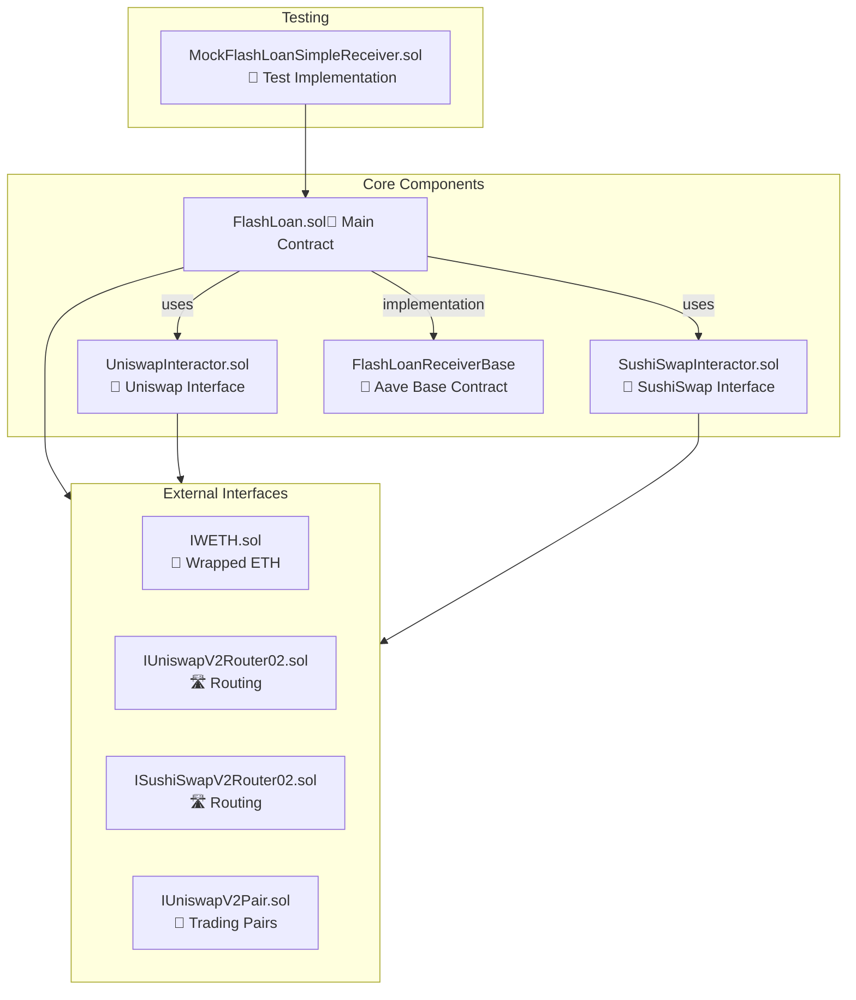
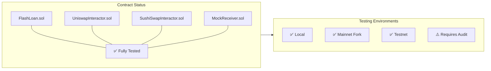

# Smart Contracts

<div align="center">
  <h1>📄</h1>
  <h3><em>Secure, efficient blockchain execution</em></h3>
</div>

---

## 🏗️ Architecture

Flash uses a modular contract system to execute flash loan arbitrage with maximum efficiency and security. Each contract serves a specific role in the ecosystem, promoting separation of concerns and maintainability.



## 📝 Core Contracts

### FlashLoan.sol

<div style="display: flex; justify-content: space-between; align-items: center;">
  <div>
    <strong>Purpose:</strong> Executes profitable arbitrage trades using borrowed capital from Aave V3.
  </div>
</div>

**Features:**

- 🛠️ Configurable arbitrage paths between any supported DEXs
- 🧩 Dynamic strategy configuration for optimal execution
- 🛡️ Precise slippage controls to prevent sandwich attacks
- 💰 Tiered fee system for sustainable platform economics
- 📊 Comprehensive event emission for transaction tracking
- ⚡ Gas-optimized for maximum capital efficiency

**Usage:**

```solidity
// Request a flash loan for arbitrage
flashLoan.requestFlashLoan(
    assetAddress,          // Token to borrow
    amountToBorrow,        // Amount to borrow
    uniswapRouterAddress,  // First DEX router
    sushiSwapRouterAddress,// Second DEX router
    wethAddress,           // Intermediate token
    slippageBps            // Slippage tolerance in basis points
);
```

### UniswapInteractor.sol

Provides a standardized interface for interacting with Uniswap V2 exchanges.

**Features:**

- 🔄 Clean abstraction for token swapping operations
- 🔍 Accurate price discovery methods
- ⚠️ Robust error handling with detailed error events
- ⛽ Gas-efficient execution paths

### SushiSwapInteractor.sol

Specialized contract for SushiSwap operations, with enhanced safety features.

**Features:**

- 🔒 Safe token approval mechanisms
- 🚨 Custom error types for precise error reporting
- 👑 Owner-controlled withdrawal functions
- ✅ Comprehensive validation checks

### MockFlashLoanSimpleReceiver.sol

A simplified implementation for testing flash loan functionality.

**Features:**

- 🧪 Implements Aave's FlashLoanSimpleReceiverBase
- 🔬 Minimal viable implementation for isolated testing
- 📣 Event emission for verification

## 🔄 Interfaces

Located in the `interfaces/` directory, these contracts standardize interaction with external protocols:

| Interface | Purpose | Protocol |
|-----------|---------|----------|
| `IUniswapV2Router02.sol` | 🛣️ Token swapping and liquidity | Uniswap V2 |
| `ISushiSwapV2Router02.sol` | 🛣️ Token swapping and liquidity | SushiSwap |
| `IUniswapV2Pair.sol` | 💱 Direct pair interactions | Uniswap V2 |
| `IWETH.sol` | 🔄 Wrapped Ether operations | WETH |

## 🛠️ Technical Stack

<div align="center">
  <table>
    <tr>
      <td width="25%" align="center">
        <h3>⚙️</h3>
        <strong>Solidity</strong><br/>
        <small>^0.8.10</small>
      </td>
      <td width="25%" align="center">
        <h3>🏦</h3>
        <strong>Aave V3</strong><br/>
        <small>Flash Loans</small>
      </td>
      <td width="25%" align="center">
        <h3>🦄</h3>
        <strong>Uniswap V2</strong><br/>
        <small>Exchange</small>
      </td>
      <td width="25%" align="center">
        <h3>🛡️</h3>
        <strong>OpenZeppelin</strong><br/>
        <small>Security</small>
      </td>
    </tr>
  </table>
</div>

## 💸 Flash Loan Execution Flow

```mermaid
sequenceDiagram
    actor User
    participant FL as FlashLoan Contract
    participant Aave as Aave V3 Pool
    participant DexA as Lower Price DEX
    participant DexB as Higher Price DEX
    
    User->>FL: requestFlashLoan()
    FL->>Aave: flashLoanSimple()
    Aave-->>FL: Transfer borrowed assets
    Aave->>FL: executeOperation()
    
    Note over FL: Check parameters are valid
    
    FL->>DexA: swapExactTokensForTokens()
    DexA-->>FL: Return intermediate tokens
    
    FL->>DexB: swapExactTokensForTokens()
    DexB-->>FL: Return original tokens
    
    Note over FL: Verify profit margin
    
    FL->>Aave: Approve repayment
    FL-->>Aave: Return loan + premium
    FL-->>User: Keep profit
    
    style User fill:#0d1117,stroke:#30363d,color:#c9d1d9
    style FL fill:#1a1b26,stroke:#30363d,color:#c9d1d9
    style Aave fill:#1a1b26,stroke:#30363d,color:#c9d1d9
    style DexA fill:#1a1b26,stroke:#30363d,color:#c9d1d9
    style DexB fill:#1a1b26,stroke:#30363d,color:#c9d1d9
```

## 🔐 Security Considerations

Flash implements multiple layers of security:

- 🔒 **SafeERC20** for protected token transfers
- ⚠️ **Custom error types** for precise revert reasons
- 👑 **Ownership controls** for administrative functions
- 🛡️ **Slippage protection** against price manipulation
- ⏱️ **Deadline parameters** to prevent stale transactions
- ✅ **Comprehensive input validation** to prevent exploits

## 📋 Prerequisites

To work with these contracts, you'll need:

- 🏦 Aave V3 pool on your target network
- 🦄 Uniswap V2 and SushiSwap deployments
- 🪙 ERC20 tokens for testing and execution
- 🛠️ Ethereum development environment (Truffle/Hardhat)

## 📊 Development Status



All contracts are functionally complete and tested on local and forked environments, but should undergo formal audit before mainnet deployment.

<div align="center">
  <h3>🔒</h3>
  <p><em>Security is our highest priority</em></p>
</div>
